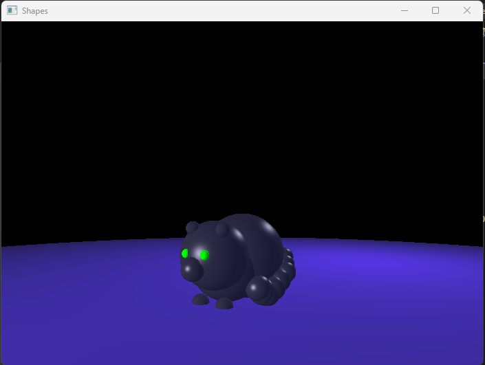

# Raytracing-Shapes-Demo
Exercise in raytracing I did for graphics class in Spring of 2022, made using OpenGL and GLUT.



You can add your own spheres to this as well. Currently the project only supports spheres, but you can add more by opening the ```model.txt``` file.

Each sphere is made of 5 pieces of data, in order representing position coordinates, radius, *ambient* color values (normalized), *diffuse* color values (normalized), and *specular* color values (normalized, also with an exponent value).

Example:
```// Blue ground
0 -5050 0 // origin
5000 // radius
.1 .1 .2 // ambient rgb
.2 .1 .6 // Diffuse red, green, blue
.0 .4 .9 70 // Specular r,g,b and exponent.```

Data entered into ```model.txt``` MUST be entered in groups of 5 lines (not counting blank or commented lines) or else the program won't run!
